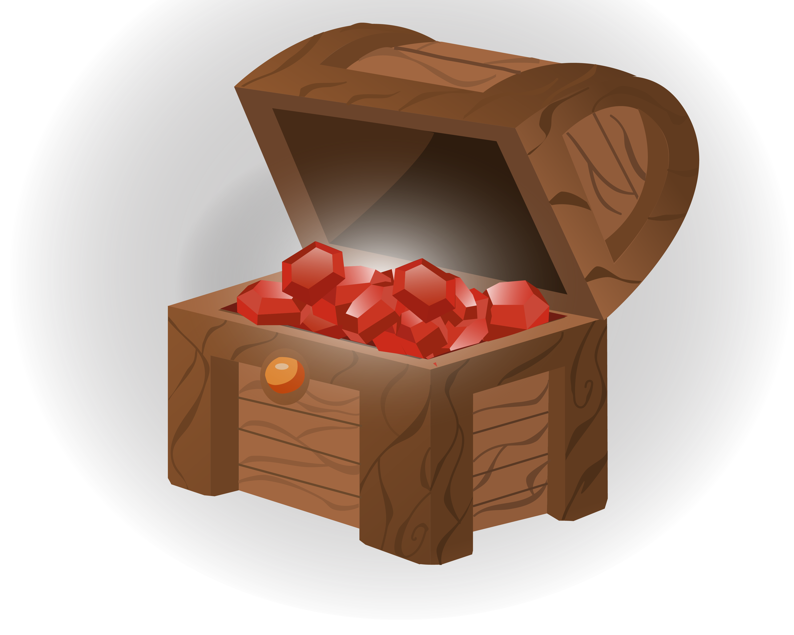

# Cave of the typomancer

## Description

Cave of the Typomancer is an arcade skill-based game, visually influenced by classic RPGs,  
where  you take on the role of an adventurer who must face an endless wave of monsters  
using their reflexes and precision.  

How far will you go?
  
## How to play

The objective of the game is to get as far as possible ***using only the 4 arrow keys***.

To defeat them, you'll have to press the keys shown on the screen in the correct order.

If you miss, you'll lose health points (HP), but if you complete the entire sequence,  
 you'll damage your opponent, causing them to lose their health points.

## The Arrows

  

Each color on the arrows has a meaning:
 
- The purple arrow is the one you need to press immediately,  

- The dimmed arrows are the ones that haven't been pressed yet   

- The green arrows are the ones that have been pressed correctly.  

Press carefully; **if you make a mistake, you'll have to start the  sequence over!**

## Power 

Both you and your enemy will have a sword below the health points; that sword **shows  
the amount of damage** that each of your next attacks will deal.

## Treasures and difficulty

The treasure chests indicate the number of enemies you have defeated; the **difficulty will  
progressively increase every 3 enemies defeated**, with 1 more arrow being added to the  
sequence, as well as an increase in the enemy's maximum health and damage by 1.

Additionally, **the enemy will auto-attack every 2.5 seconds**, adding some excitement and difficulty  
to something as trivial as pressing keys.

## DEMO

### Here’s the [link](https://vicenteduch.github.io/javascript-game-project-typo/) to Cave of the Typomancer, I hope you like it!

